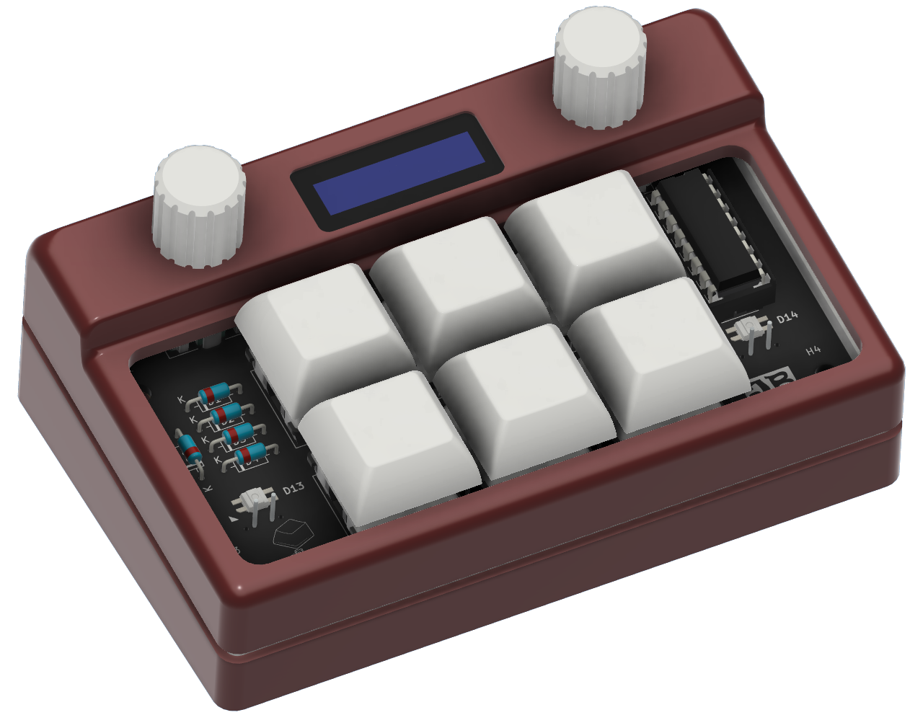
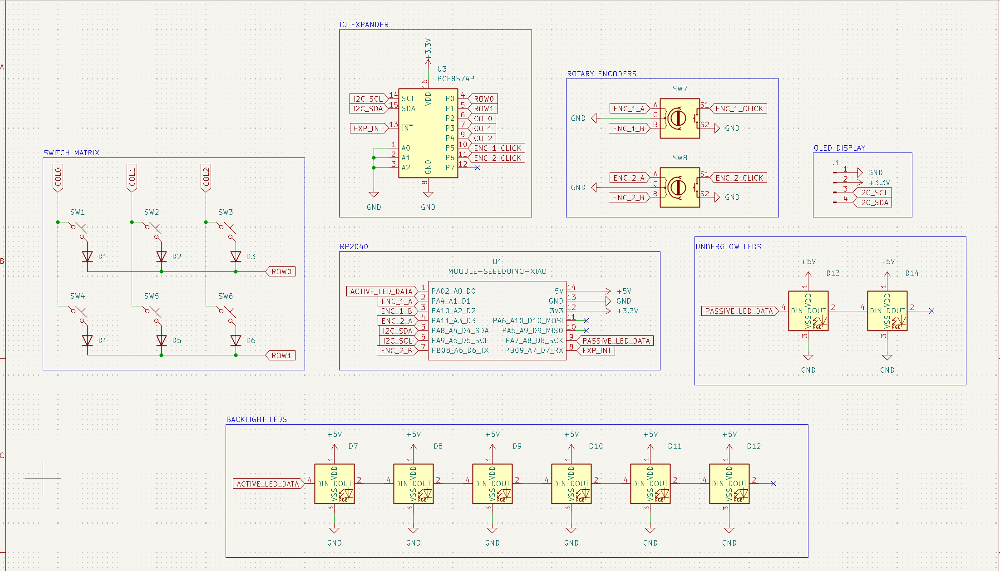
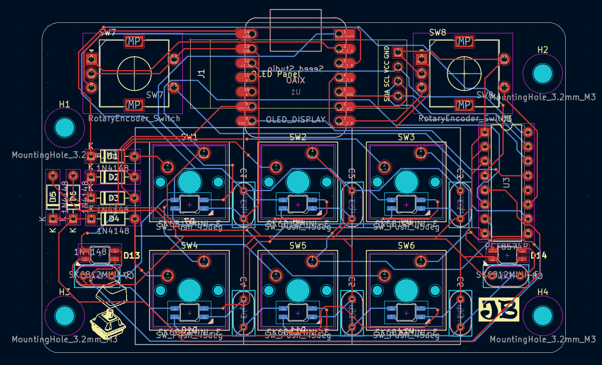
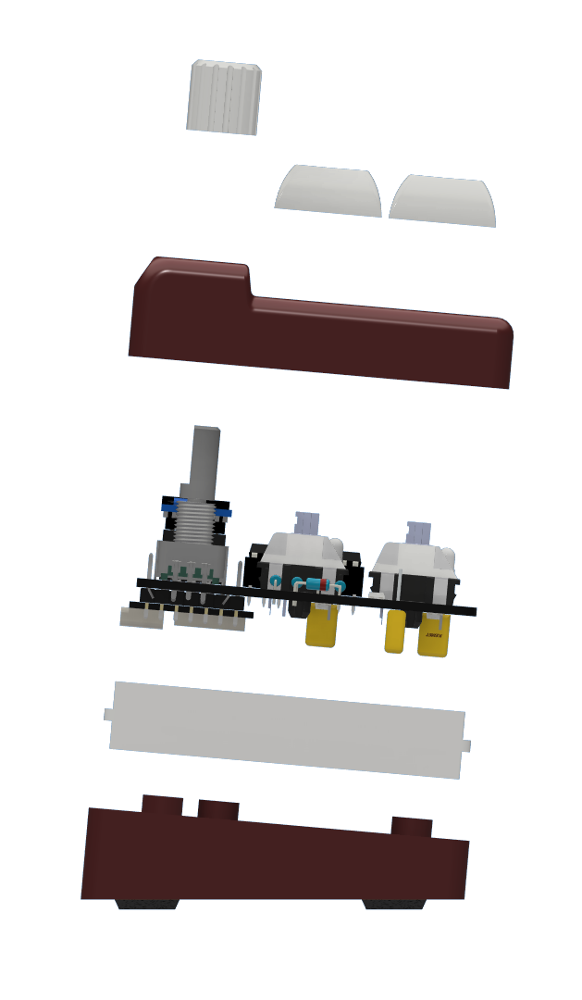

# DuoSix
DuoSix is a 6-key, dual-encoder macropad powered by a Seeed Studio XIAO RP2040 and a PCF8574N IO Expander. 

Right now, the buttons are just bound to media controls, but I intend to update the code in the future to store "libraries" of key presets based on different apps or uses, which can be navigated and selected through the OLED and one of the encoders.

I made this project to learn how to use some new programs, while challenging myself to make something that I'll want to use for a long time. While I have experience in CAD and some of EDA in fusion, I had zero expereience in KiCad or Github before this project, so figuring everything out over about four days felt great.

---
**DuoSix Full Assembly**

---

**KiCad Schematic**

---

**KiCad PCB Routing**

---

**Case and PCB Fitment**

This design utilizes mostly press-fit connection. The PCB is mounted to the bottom case using M3x6 screws, and the diffusing ring is set in place around it, and in contact with the base. The diffusing ring is then slotted into the top case, holding the case together. I also made knobs to press-fit onto the rotary encoders.

---
### Bill of Materials (BOM)

**Included:**
* 1x Seeed Studio XIAO RP2040
* 6x MX-Style switches
* 6x DSA keycaps
* 2x EC11 rotary encoders
* 1x 0.91 inch OLED display
* 6x 1N4148 diodes
* 8x SK6812 MINI-E LEDs
* 4x M3x5mx4mm heatset inserts

**Self Sourced:**
* 1x PCF8574N IO expander
* 1x 16 pin IC socket
* 8x 0.1 μF ceramic capacitors
* 1x 4 pin female socket
* 3D Printed Case Components (Top, Bottom, Diffuser)
* 4x M3x6mm screws
* 4x rubber feet